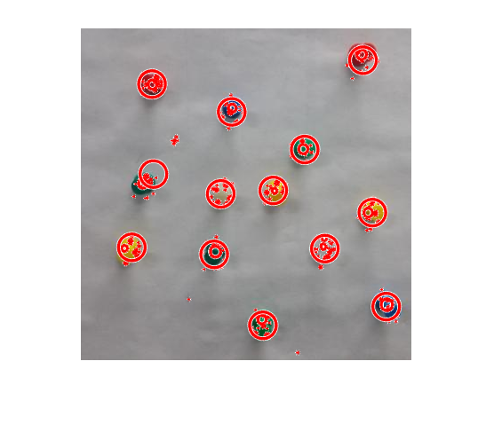

# Object-Detection-using-Color-Segmentation
Identify the pins in the image along with their color.

# Run the program in MATLAB
Input Image

# Output
Step 1: Edge detection

Step 2: k-means to form clusters
Step 1: Edge detection

Steps 3: Detect colors using thresholding in RGB space
Step 1: Edge detection

